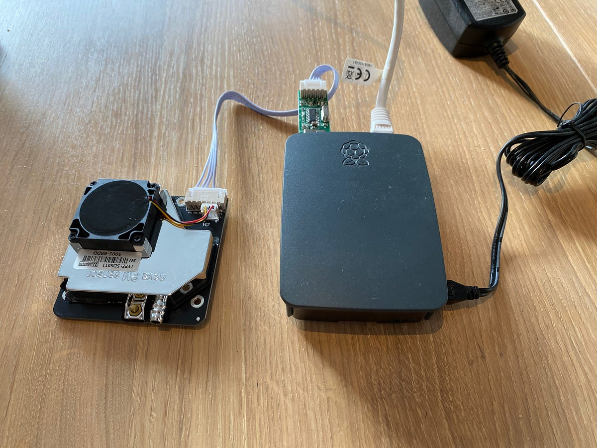
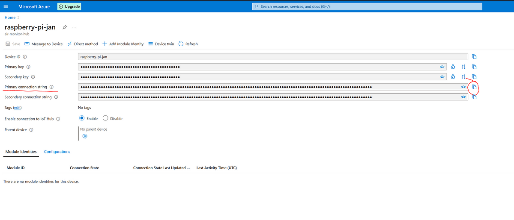

# Raspberry Pi Air Quality Monitor

A simple air quality monitoring service for the Raspberry Pi. It uses a Nova PM Sensor (SDS011) to measure the air
quality and sends the data to Azure IoT Hub.

To set this up you need

- Raspberry Pi
- Nova PM Sensor (SDS011)
- Container to keep the sensor in

Here is how it looks like:



## Install required packages for Raspberry Pi

### Install Python packages (for sendTestDataToAzure.py)

```bash
python -m pip install --upgrade pip
pip install portalocker
pip install azure-iot-device
pip install pyserial
pip install asyncio

```

### Install .NET 6 (for AirQuality.Console)

```bash
wget -O - https://raw.githubusercontent.com/pjgpetecodes/dotnet6pi/master/install.sh | sudo bash
```

## Setup

Set access key for Azure IoT Hub:



```bash
export IOTHUB_DEVICE_CONNECTION_STRING='HostName=air-monitor-hub.azure-devices.net;DeviceId=measuring-device-id;SharedAccessKey=XXXXXXXXX_YOUR_ACCESS_KEY_XXXXXX
```

## Test

To test the sensor, run the following command:

```bash
python /home/pi/git/pi_air_quality_monitor/scripts/getMeasurement.py
```

This should print out something like:

```json
{
  "device_id": "your device id",
  "pm10": 10.8,
  "pm2.5": 4.8
}
```

## Run continuously in the background and send data to azure every minute

To run, use the run command:

```bash
nohup python -u /home/pi/git/pi_air_quality_monitor/scripts/sendTestDataToAzure.py >> azurelog.log &
```

## Cronjob to do a bulk insert every night at 04:00 to the Azure SQL Database

    1. Open the terminal and type crontab -e. This command opens the cron table for the current user in the default text editor.
    2. Add the following line to the file:

```bash
0 4 * * * /bin/bash -c '/home/pi/git/pi_air_quality_monitor/src/AirQuality.Console/dotnet run -f /$(date -d yesterday "+%Y/%m/%d")/measurements.csv -c "your_connection_string"'
```

    3. Save the file and exit the editor.
    4. Remember to change the path to the measurements.csv file and the connection string to your Azure SQL Database.

## Stop script

To kill you script, you can use ps -aux and kill commands.

```bash
ps -aux | grep python
```

This should show something like this:

```
pi       23338  0.0  2.2  93084 21384 ?        Sl   Feb10  20:14 python -u /home/pi/git/pi_air_quality_monitor/scripts/sendTestDataToAzure.py
```

Then you can kill the process like this:

```bash
kill -9 23338
```


