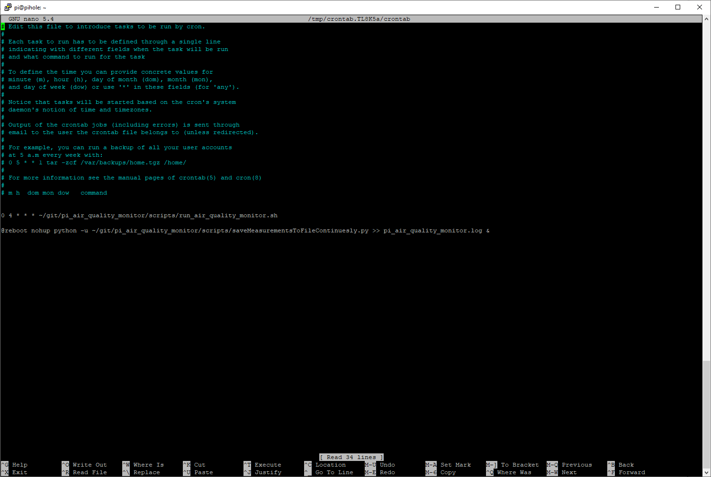

# Medium Article (Norwegian)

https://medium.com/systek/bygg-ditt-eget-luftkvalitetssystem-med-raspberry-pi-og-azure-b354da54582b


# Raspberry Pi Air Quality Monitor

A simple air quality monitoring service for the Raspberry Pi. It uses a Nova PM Sensor (SDS011) to measure the air
quality and sends the data to Azure IoT Hub.

To set this up you need

- Raspberry Pi
- Nova PM Sensor (SDS011)
- Container to keep the sensor in

Here is how it looks like:

# Final Result


# Avalonia UI


# Aggregated data


## Install required packages for Raspberry Pi

1.  Install Python packages (for sendTestDataToAzure.py)

```bash
python -m pip install --upgrade pip
pip install portalocker
pip install azure-iot-device
pip install pyserial
pip install asyncio
pip install pytz
```

2.  Install .NET 6 (for AirQuality.Console)

```bash
wget -O - https://raw.githubusercontent.com/pjgpetecodes/dotnet6pi/master/install.sh | sudo bash
```

## Setup

Set access key for Azure IoT Hub:


```bash
export IOTHUB_DEVICE_CONNECTION_STRING='HostName=air-monitor-hub.azure-devices.net;DeviceId=measuring-device-id;SharedAccessKey=XXXXXXXXX_YOUR_ACCESS_KEY_XXXXXX
```

## Test

To test the sensor, run the following command:

```bash
python /home/pi/git/pi_air_quality_monitor/scripts/getMeasurement.py
```

This should print out something like:

```json
{
  "device_id": "your device id",
  "pm10": 10.8,
  "pm2.5": 4.8
}
```

## Run continuously in the background and send data to azure every minute

To run, use the run command:

```bash
nohup python -u /home/pi/git/pi_air_quality_monitor/scripts/sendTestDataToAzure.py >> azurelog.log &
```

## Stop script

To kill you script, you can use ps -aux and kill commands.

```bash
ps -aux | grep python
```

This should show something like this:

```
pi       23338  0.0  2.2  93084 21384 ?        Sl   Feb10  20:14 python -u /home/pi/git/pi_air_quality_monitor/scripts/sendTestDataToAzure.py
```

Then you can kill the process like this:

```bash
kill -9 23338
```

## Cronjob to do a bulk insert all measurements from the .CSV file every night at 04:00 to the Azure SQL Database

1. Update appsettings.json with the connection string to your Azure SQL Database

appsettings.json should look like this:

```json
{
  "ConnectionStrings": {
    "DefaultConnection": "Server=tcp:your-server.database.windows.net,1433;Initial Catalog=your-database;Persist Security Info=False;User ID=your-user;Password=your-password;MultipleActiveResultSets=False;Encrypt=True;TrustServerCertificate=False;Connection Timeout=30;"
  }
}
```

2. Build the project by running "dotnet build src/AirQuality.Console/AirQuality.Console.csproj" (make sure dotnet is
   installed)

Should look like this:

```bash
pi@pihole:~/git/pi_air_quality_monitor $ dotnet build src/AirQuality.Console/AirQuality.Console.csproj
MSBuild version 17.3.2+561848881 for .NET
  Determining projects to restore...
  All projects are up-to-date for restore.
  AirQuality.Common -> /home/pi/git/pi_air_quality_monitor/src/AirQuality.Common/bin/Debug/net6.0/AirQuality.Common.dll
  AirQuality.Console -> /home/pi/git/pi_air_quality_monitor/src/AirQuality.Console/bin/Debug/net6.0/AirQuality.Console.dll

Build succeeded.
    0 Warning(s)
    0 Error(s)

Time Elapsed 00:00:11.39
```

3. Navigate to the scripts folder
4. Update the **run_air_quality_monitor.sh** script with the correct path to the AirQuality.Console project
5. Make the **run_air_quality_monitor.sh** script executable

```bash
chmod +x run_air_quality_monitor.sh
```

6. Open the terminal and type **crontab -e**. This command opens the cron table for the current user in the default text
   editor. (note, this is crontab -e for the current user, not sudo crontab -e.)
7. Add the following line to the file:

```bash
0 4 * * * ~/git/pi_air_quality_monitor/scripts/run_air_quality_monitor.sh

@reboot nohup python -u ~/git/pi_air_quality_monitor/scripts/saveMeasurementsToFileContinuesly.py >> ~/pi_air_quality_monitor.log &
```
8. This will run the run_air_quality_monitor.sh script every night at 04:00. This will upload all measurements from the
   .CSV file to the SQL Database (for the previous day). Second, it will run the saveMeasurementsToFileContinuesly.py script on reboot. 
   This will run continuously and save measurements to a .CSV file every minute.

9. Make sure the path is correct. Save the file and exit the editor.



This will navigate to /home/username/pi_air_quality_monitor/src/AirQuality.Console/bin/Debug/net6.0 and run the dotnet
project with the argument ~/$(date -d yesterday "+%Y/%m/%d")/measurements.csv.

(date -d yesterday "+%Y/%m/%d") will get the date of yesterday and format it as YYYY/MM/DD. (same as the folder
structure of the measurements.csv files)
The job will run every night at 04:00.

Around 1440 measurements will be inserted into the database every night.


